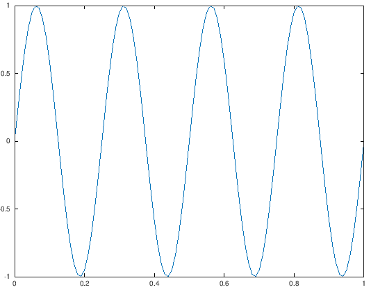
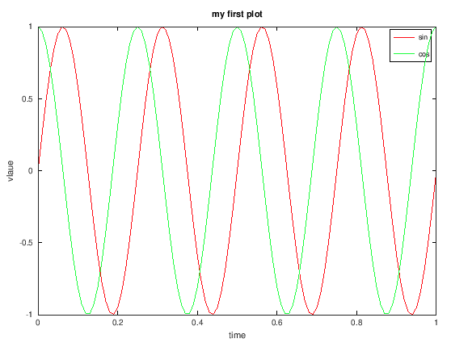
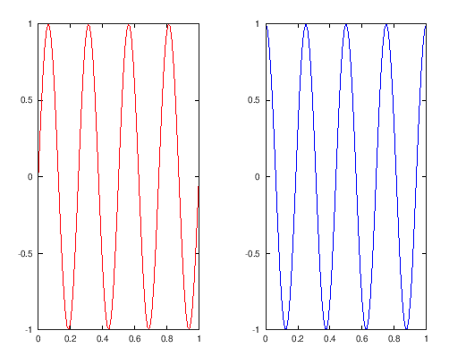
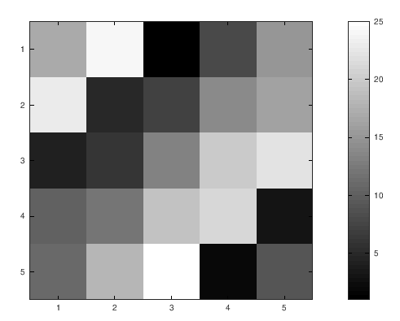

# Octave

## Settings

Change prompt in octave-cli
```octave
PS1('>> ')
```

## Basic Operations

addition / subtraction / multiplication / division
```octave
5 + 6
ans =  11
5 - 6
ans = -1
5 * 6
ans =  30
5 / 6
ans =  0.83333
```

Exponentially (to the pair)
```octave
2^6
ans =  64
```

logical operation

```octave
1 == 2 % false
ans = 0

1 == 1 % true
ans = 1

1 ~=2 % not equal (not the tilde symbol)
ans = 1

1 && 0 % local AND => false
ans = 0

1 || 0 % local OR => false
ans = 1

xor(1,) % XOR-operation => true
ans = 1
```

## variable

with the semicolon (;) at the end of your command you will supressing the output.

```octave
>> a = 1
>> b = 2;
>> c = 3;
a =  1

>> c = (3>=1)
c = 1
```

String

```octave
>> a = 'hello world'
a = hello world
>> a
a = hello world
```

display a string

```octave
>> pi_variable = pi;
>> disp(pi_variable); % display a variable
 3.1416
>> disp(sprintf('2 deciamls: %0.2f', pi_variable)) % hello c-code
2 deciamls: 3.14
>> disp(sprintf('6 deciamls: %0.6f', pi_variable)) % hello c-code
6 deciamls: 3.141593

```

output format

```octave
format long % long output format
>> pi_variable
pi_variable =  3.141592653589793

% default
format short % short output format
>> pi_variable
pi_variable =  3.1416
```

*Vector and matrices*

define matrix
```octave
>> A = [1 2; 3 4; 5 6] % 3 by 2 matrix
A =

   1   2
   3   4
   5   6

```

define e (row) vector or a 1 by 3 matrix
```octave
>> v = [1 2 3]
v =

   1   2   3
```

define e (column) vector or a 3 by 1 matrix

```octave
>> v = [1; 2; 3]
v =

   1
   2
   3
```

useful notation: (start by 1 - steps = 0.1 - end at 2)
```octave
>> v = 1:0.1:2 % 1 by 11 matrix
v =

 Columns 1 through 8:

    1.0000    1.1000    1.2000    1.3000    1.4000    1.5000    1.6000    1.7000

 Columns 9 through 11:

    1.8000    1.9000    2.0000

>> v = 1:6
v =

   1   2   3   4   5   6
```

matrix _or N-dimensional_ array whose elements are all 1(ones) oder 0(zeros). `ones (m, n)`
```octave
>> ones(2,4) % 2 by 4 matrix
ans =

   1   1   1   1
   1   1   1   1
>> 2*ones(2,4) % 2 by 4 matrix with 2
ans =

   2   2   2   2
   2   2   2   2
>> zeros(2,4) % 2 by 4 matrix with zeros
ans =

   0   0   0   0
   0   0   0   0
```

rand = random elements uniformly distributed 
randn = random normally distributed random
```octave
>> rand(1,3)
ans =

   0.098862   0.213853   0.340321
```

identity matrix
```octave
>> eye(6) % returns a 6 by 6 identity matrix
ans =

Diagonal Matrix

   1   0   0   0   0   0
   0   1   0   0   0   0
   0   0   1   0   0   0
   0   0   0   1   0   0
   0   0   0   0   1   0
   0   0   0   0   0   1
```

help function
```octave
>> help (function)
```

# Moving data around

size of a matrix
```octave
>> size(A) % 3 by 2 matrix
ans =

   3   2
>> size(A,1) % number of rows
ans =  3 
>> size(A,2) % number of columns
ans = 2
>> v = [1 2 3 4];
>> length(v) % length of a vector
ans =  4
```

load & save from/to a file
```octave
>> load {file.dat}
>> save {file.mat} v % in binary
>> save {file.dat} v -ascii % save as text (ASCII)

```

show what variables (with whos in detail) in my octave workspace
```octave
>> who
Variables in the current scope:

A            ans          c            v
a            b            pi_variable  w
>> whos
Variables in the current scope:

   Attr Name             Size                     Bytes  Class
   ==== ====             ====                     =====  ===== 
        A                3x2                         48  double
        a                1x11                        11  char
        ans              1x74                        74  char
        b                1x1                          8  double
        c                1x1                          1  logical
        pi_variable      1x1                          8  double
        v                1x4                         32  double
        w                1x10000                  80000  double

Total is 10098 elements using 80182 bytes
```

delete a variable from the octave workspace
```octave
>> who
Variables in the current scope:

A            ans          c            v
a            b            pi_variable  w
>> clear pi_variable % without a parameter, they will clear all variables
>> who
Variables in the current scope:

A    a    ans  b    c    v    w
```

show a subset, in this cas only the first five values from a vector
```octave
>> w(1:5)
ans =

  -0.71167  -1.27865  -0.81043  -0.44365  -0.86309
>> size(w(1:5))
ans =

   1   5
```

show a subset of a matrix
```octave
>> A = [1 2; 3 4; 5 6]
A =

   1   2
   3   4
   5   6
>> A(3,2)
ans =  6
>> A(2,:) % means everey element along that row/column
ans =

   3   4
>> A(:,2)
ans =

   2
   4
   6
```

replace / append values from an existing matrix
```octave
>> A
A =

   1   2
   3   4
   5   6
>> A(:,2) = [10, 11, 12]
A =

    1   10
    3   11
    5   12
>> A = [A, [100; 101; 102]] % append another column vector to right
A =

     1    10   100
     3    11   101
     5    12   102
>> size(A)
ans =

   3   3
>> A(:) % put all element of A in a single column vector
ans =

     1
     3
     5
    10
    11
    12
   100
   101
   102

```

concate two matrixes
```octave
>> A = [1 2; 3 4; 5 6];
>> B = [11 12; 13 14; 15 16];
>> C = [A B]
C =

    1    2   11   12
    3    4   13   14
    5    6   15   16
>> C = [A; B] % put the matrix B at the bottom
C =

    1    2
    3    4
    5    6
   11   12
   13   14
   15   16

```

## Computing on data

multiply two matrix
```octave
>> A
A =

   1   2
   3   4
   5   6
>> C = [1 1; 2 2];
>> A*C
ans =

    5    5
   11   11
   17   17
```

element wise multiplication or squaring
```octave
>> A .* B % multiplication
ans =

   11   24
   39   56
   75   96
>> A .^ 2 % squar
ans =

    1    4
    9   16
   25   36
```
Compute the natural logarithm and Compute 'e^x' for each element of X.
```octave
>> v = [1; 2; 3];
>> log(v)
ans =

   0.00000
   0.69315
   1.09861
>> exp(v)
ans =

    2.7183
    7.3891
   20.0855
```

absolute values 
```octave
>> abs([-1, 2 -3])
ans =

   1   2   3
```

transpose of a matrix
```octave
>> A
A =

   1   2
   3   4
   5   6

>> A' 
ans =

   1   3   5
   2   4   6
```

Create an N-by-N magic square.
```octave
>> A = magic(3)
A =

   8   1   6
   3   5   7
   4   9   2
>> [r,c] = find( A >= 7) % find all values that they are high or e.q. seven
r =

   1
   3
   2

c =

   1
   2
   3
```

some calculate function
```octave
>> a = [1, 15, 2, 0.5];
>> sum (a) % Sum of elements
ans =  18.500
>> prod (a) % Product of elements
ans =  15
>> floor (a) % round down
ans =

    1   15    2    0

>> ceil (a) % round up
ans =

    1   15    2    1
```

## Plotting Data

```octave
>> t = [0:0.01:1];
>> y1 = sin(2*pi*4*t);
>> plot(t, y1)
```


some other plots
```octave
>> y1 = sin(2*pi*4*t);
>> y2 = cos(2*pi*4*t);
>> plot(t,y1, 'r')
>> hold on;
>> plot(t,y2, 'g')
>> xlabel('time')
>> ylabel('vlaue')
>> legend ('sin', 'cos')
>> title('my first plot')
```


Sub plotting
```octave
>> subplot(1,2,1) % divides plot a 1x2 (first)
>> plot(t,y1, 'r')
>> subplot(1,2,2) 
>> plot(t,y2, 'b') % second
```



Plot a matrix and show their values
```octave
>> A = magic(5)
>> imagesc(A), colorbar, colormap gray;
```


## Control statements (for, while, if) and functions

for loop
```octave
>> for i=1:10,
  v(i) = 2^i;
end;
>> v
v =

      2
      4
      8
     16
     32
     64
    128
    256
    512
   1024
```

while loop
```octave
>> i = 1;
>> while i <= 5,
    v(i) = 100;
    i = i+1;
end;
>> v
v =

    100
    100
    100
    100
    100
     64
    128
    256
    512
   1024
```

function
```octave
>> function name (arg-list)
  body
endfunction
>> squareThisNumber(2)
ans =  4
```
